<!--
title:   懐かしさ全開の初代ポケモンガチャアプリをNext.jsで作ってみた
tags:    React,next.js,pokemon,tailwindcss,ポケモン
id:      bbb06be7014896fde7ad
private: false
-->

20 代後半から 40 代ぐらいの人は心がホカホカすること間違いなしです！

ゲームボーイの UI でポケモンをガチャガチャしたり、ポケモン図鑑機能があったりするアプリを作りました！

# 完成物

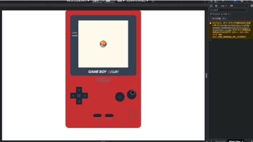

URL : https://poke-gacha-ver-2-0.vercel.app
GitHub : [https://github.com/mitochon9/poke-gacha-ver.2.0](https://github.com/mitochon9/poke-gacha-ver.2.0)

# 作った経緯

Next.js で API を叩いて何か作りたいなーと思っていたところ、 [PokeAPI](https://pokeapi.co/) なんてものがあるよ！って聞いて作りました。

1 回目の制作はディスプレイ部分だけで、なおかつバグだらけだったのですが、色々学習・開発して今ならもっとうまく作れるんじゃないかとカムバック制作しました。

# 仕様・画面遷移図

- ゲームボーイのボタンのみで全操作ができる
- ゲームボーイのデザインは CSS で実装（ローカルの画像はトップのレッドとヒトカゲ、モンスターボールのみ）
- ガチャ中は他の操作を受け付けない
- ガチャ結果画面で A ボタンを押すことで再度ガチャ実行する
- 抽選で選ばれたポケモンのデータは localStorage に保存され、ユーザーが削除できるようにする
- ポケモン図鑑は十字キーを押すことで画面スクロールできる
- 画面遷移図のルート以外での意図しない動作をしない

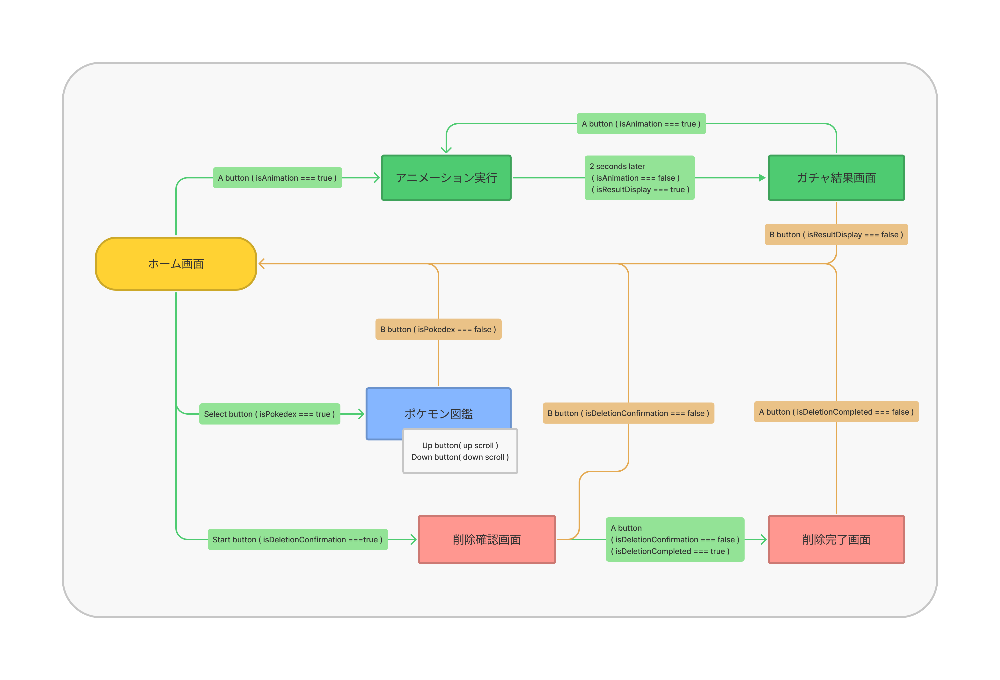

素材画像は[ひこちゃんず！](http://hikochans.com/)から使用させていただきました。

# 使用技術

- Next.js ( React )
- TypeScript
- Tailwind CSS

# 見た目部分の実装

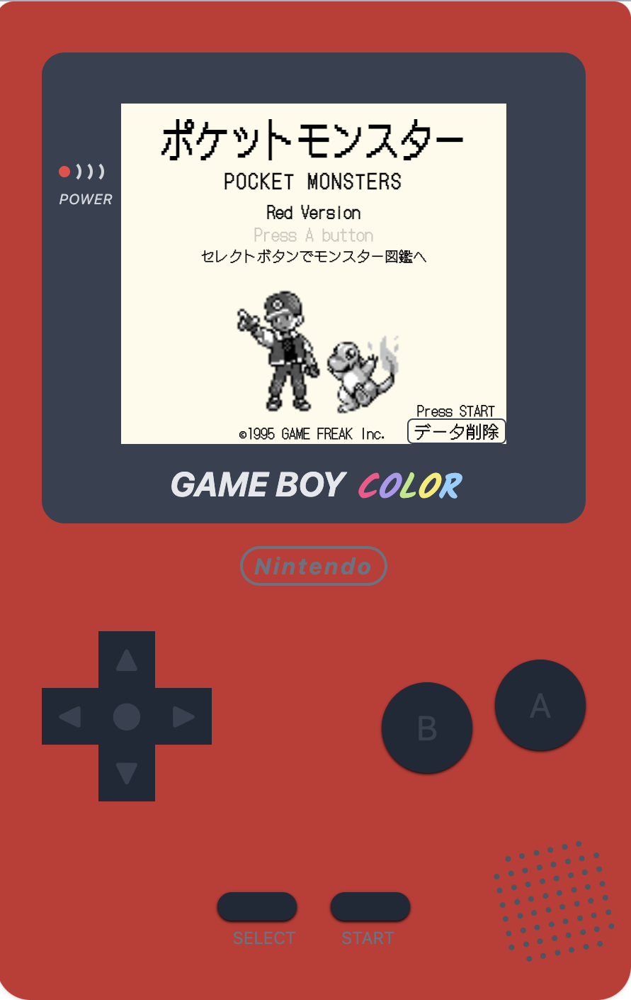

こだわった部分を抜粋して紹介します！

デザインは CSS で実装しました。 用意した画像はトップ画面のレッド、ヒトカゲ、モンスターボールのみです。

[ホンモノのゲームボーイ画像（ Nintendo のサイトに飛びます）](https://www.nintendo.co.jp/n02/dmg/hardware/color/color.html)

### フォント

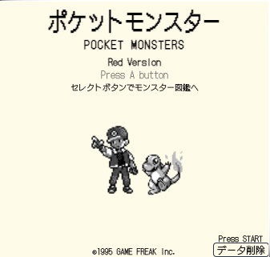

[Google Fonts](https://fonts.google.com/) で [DotGothic16](https://fonts.google.com/specimen/DotGothic16?query=dotgothic) といったフォントを採用しました。

レトロなゲームボーイの世界観にぴったりなフォントです。

Tailwind CSS でのフォントの設定は下記のようにすればできます。

```js
// tailwind.config.js

module.exports = {
  ...
  theme: {
    extend: {
      fontFamily: {
        kalam: ["Kalam"],
        dot: ["DotGothic16, sans-serif"],
      },
    },
  },
  ...
};
```

```css
@import url("https://fonts.googleapis.com/css2?family=Kalam:wght@700&display=swap");
@import url("https://fonts.googleapis.com/css2?family=DotGothic16&display=swap");

@tailwind base;
@tailwind components;
@tailwind utilities;

...
```

### GAMEBOY COLOR のロゴ部分


色んな人に「画像だと思った！」と言われた部分です。

自分でも良くできたんじゃないかとニヤニヤしています。

GAME BOY の部分は italic でそれっぽくしています。

COLOR の部分は [Kalam](https://fonts.google.com/specimen/Kalam?query=Kalam) といったフォントを採用しました。

```tsx
// DisplayLogo.tsx

export const DisplayLogo = () => (
  <div className="flex relative z-10 justify-center -mt-11 text-2xl italic font-bold text-gray-200">
    <span className="mr-2">GAME BOY</span>
    <div className="mt-1 font-karam">
      <span className="text-[#FB4E8B]">C</span>
      <span className="text-[#AE97F1]">O</span>
      <span className="text-[#BBE880]">L</span>
      <span className="text-[#FAEB67]">O</span>
      <span className="text-[#8CD0FF]">R</span>
    </div>
  </div>
);
```

### ゲームボーイ右下のスピーカー部分

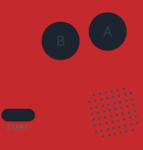

こんな細かい部分いっか…と最初は思っていたのですが、やるんならしっかりやるか！と作りました。

最初は 60 個の空文字配列を手書きで作っていたのですが、効率的じゃないな…と感じて変更しました。

画面表示時に for 文で 60 個の空文字配列 → [ ’’ , ’’ , ’’ , ... ] を作り map() 関数で並べています。

**追記**

for 文で 60 個の配列を作っていましたが、 Array.from() メソッドで簡単に作れました。

```tsx
// Speaker.tsx

import { useCallback, useEffect, useState } from "react";

export const Speaker = () => {
  const [volumeHole, setVolumeHole] = useState<string[]>([]);

  // 60個の空文字の配列を作る

  // 削除
  // const createVolumeHole = useCallback(() => {
  //   for (let index = 0; index < 60; index++) {
  //     setVolumeHole((volumeHole) => [...volumeHole, ""]);
  //   }
  // }, []);

  // 画面表示時に空文字の配列を作る関数を実行;
  // useEffect(() => {
  //   createVolumeHole();
  // }, []);

  const volumeHole = Array.from({ length: 60 }, (_, i) => {
    return {
      id: i,
      value: "",
    };
  });

  return (
    <div className="absolute right-3 -bottom-2 -rotate-12">
      <div className="grid grid-cols-8 grid-rows-[8] gap-[2px] w-20 h-20">
        {volumeHole.map((item) => (
          <div
            key={item.id}
            className={`w-1 h-1 rounded-full bg-gray-600 ${
              item.id === 0 || item.id === 54
                ? // 左上角、左下角の場合
                  "col-start-2"
                : item.id === 5 || item.id === 59
                ? // 右上角、左下角の場合
                  "col-span-2"
                : // それ以外
                  "col-span-1"
            }`}
          >
            {item.value}
          </div>
        ))}
      </div>
    </div>
  );
};
```

### モンスターボールのアニメーション


CSS アニメーションで作りました。

あまり CSS アニメーションに慣れていなかったので地道に設定していきましたが、動きを想像して作れる人はすごいですね…。

```css
.ball-animation {
  animation: shake 2s linear;
}

@keyframes shake {
  0% {
    transform: rotate(-30deg);
  }
  10% {
    transform: rotate(30deg);
  }
  20% {
    transform: rotate(-30deg);
  }
  30% {
    transform: rotate(-30deg);
  }
  40% {
    transform: rotate(30deg);
  }
  50% {
    transform: rotate(-30deg);
  }
  60% {
    transform: rotate(-30deg);
  }
  65% {
    transform: rotate(0deg);
  }
  70% {
    transform: rotate(30deg);
  }
  75% {
    transform: rotate(-30deg);
  }
  80% {
    transform: rotate(-30deg);
  }
  100% {
    transform: rotate(-30deg);
  }
}
```

### ガチャ結果画面

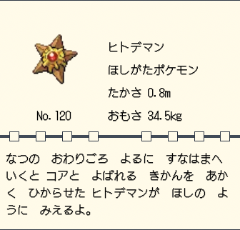

ポケモン図鑑はなるべく本家に近づけるように作りました！

[ホンモノの画像（ Gigazine のポケモン図鑑ジェネレーター紹介ページ）](https://gigazine.net/news/20171215-pokemon-guide-generator/)

↑ ポケモン図鑑ジェネレーター、アイデアがすごいなと思いました！（現在はリンクが切れているようです）

[Gigazine](https://gigazine.net/) は職場の近くに会社があって、いつも憧れの眼差しを向けながら前を通るので、Gigazine に掲載されるようなプロダクトを作りたいです！（欲を言うならこのアプリで掲載されたい）

配置に関しては grid で配置するのが便利でした。

grid は Internet Explorer 以外のブラウザで全て対応しているんですね！（さよなら IE ）

参考： [grid #ブラウザーの互換性](https://developer.mozilla.org/ja/docs/Web/CSS/grid#%E3%83%96%E3%83%A9%E3%82%A6%E3%82%B6%E3%83%BC%E3%81%AE%E4%BA%92%E6%8F%9B%E6%80%A7)

grid で実装するとコード量が減って構造が把握しやすいのもいいですね。（ FlexBox の場合、どうしても div が増えてしまう）

```tsx
<div className="grid grid-cols-7">
  <div className="col-span-3">画像</div>

  <div className="col-span-4">データ</div>

  <div className="col-span-7">区切り線</div>

  <div className="col-span-7">説明文</div>
</div>
```

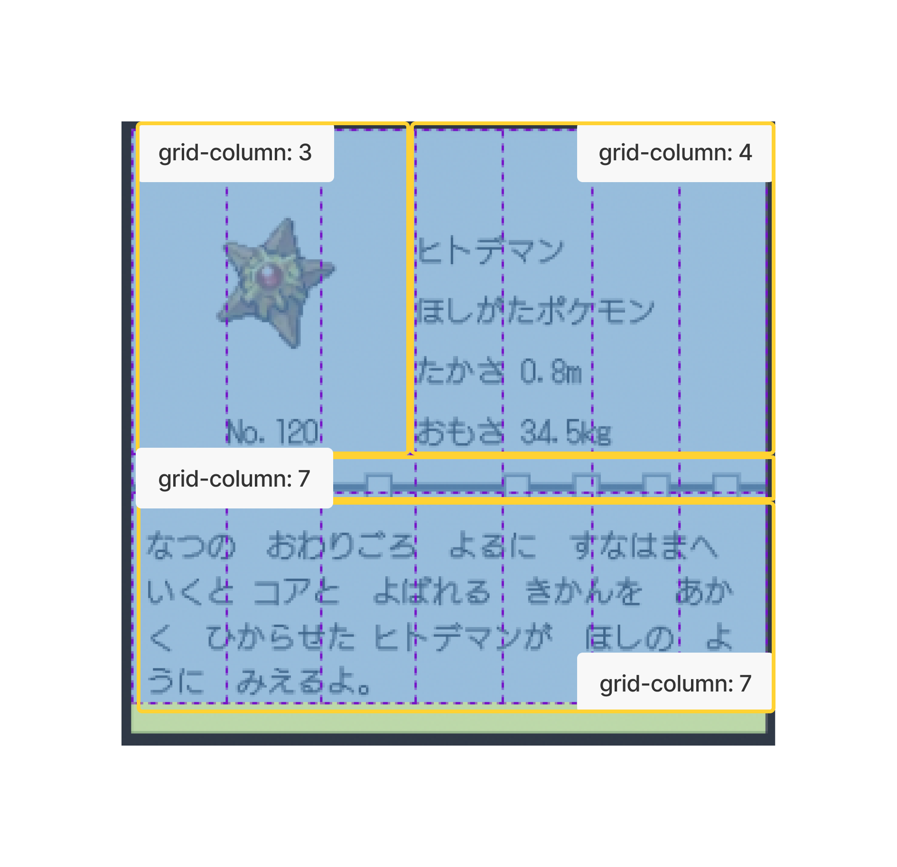

真ん中の線の上の “□” は空文字の配列を map() 関数で並べて position: absolute で位置調節しました！

```tsx
<div className="relative col-span-7 mt-2 w-full border-2 border-gray-600">
  <div className="flex absolute top-[-7px] col-span-7 justify-around w-full">
    {["", "", "", "", "", "", "", "", ""].map((item, index) => (
      <div
        key={index}
        className={`z-10 w-[14px] h-[14px]  ${
          index === 4 ? "" : "bg-amber-50 border border-gray-700"
        } `}
      >
        {item}
      </div>
    ))}
  </div>
</div>
```

# 機能の実装

## 画面遷移

useState の boolean によって画面の出し分けをしています。

props のバケツリレーにならないように [recoil](https://recoiljs.org/) での状態管理をしています。

```tsx
// Display.tsx

...

{isAnimation ? (
  <MonsterBallAnimation />
) : isPokedex ? (
  <Pokedex />
) : isResultDisplay ? (
  <ResultDisplay />
) : isDeletionConfirmation ? (
  <DeletionConfirmation />
) : isDeletionCompleted ? (
  <DeletionCompleted />
) : (
  <TopDisplay />
)}

...
```

## ボタンクリック時の挙動

ゲームボーイのボタンごとに機能を持たせています

- A ボタン
  - ガチャ実行画面へ遷移
  - 図鑑削除決定
- B ボタン
  - キャンセル・画面バック
- Select ボタン
  - ポケモン図鑑へ遷移
- Start ボタン
  - 削除確認画面へ遷移
- 十字キー上下
  - ポケモン図鑑でのディスプレイ上下スクロール

B ボタン・ Select ボタン・Start ボタンの機能は boolean の切り替えです。

十字キーボタンの機能についてはポケモン図鑑機能部分で後述します。

### A ボタンの機能の出し分け

削除確認画面、削除完了画面、それ以外と状態によって機能を切り替えています。

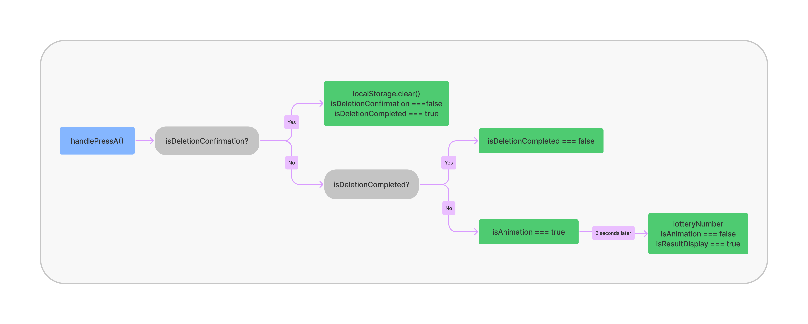

```tsx
const handlePressA = useCallback(() => {
    if (isDeletionConfirmation) {
      // localStorage のデータ削除の処理
			...
      return;
    }

    if (isDeletionCompleted) {
      // 「削除しました」のレスポンスとしての挙動。トップ画面へ遷移する
			...
      return;
    }

    // isDeletionConfirmation , isDeletionConfirmation のどちらでもない場合に、モンスターボールのアニメーション画面へ遷移する
	    ...
	  }, [...]);
```

## ガチャ機能

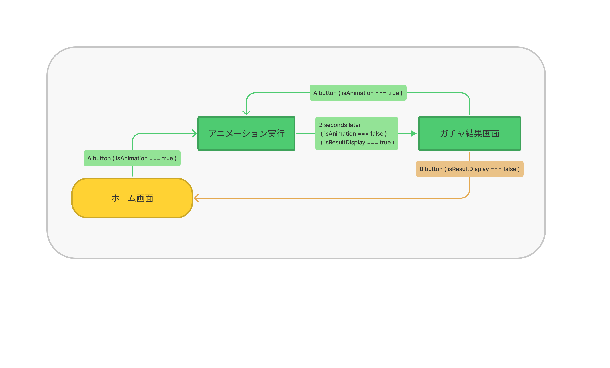

### アニメーション

A ボタンクリック後、

1〜151 の数値抽選 + 2 秒間のアニメーション（ isAnimation === true ）

↓

setTimeout() でアニメーション後、結果を表示（ isAnimation === false , isResultDisplay === true ）

といった流れで実装しています。

Math.random() 部分の書き方は MDN で[2 つの値の間のランダムな整数を得る](https://developer.mozilla.org/ja/docs/Web/JavaScript/Reference/Global_Objects/Math/random#getting_a_random_integer_between_two_values)を参考にしました。

```tsx
const handlePressA = useCallback(() => {
	...

	// モンスターボールのアニメーション画面へ遷移
	setIsAnimation(true);
	// 1 〜 151 の数値をランダムに抽選
	const lotteryNumber = Math.floor(Math.random() * (151 - 1) + 1);
	setPokemonId(lotteryNumber);

	// 2秒後にガチャ結果画面を表示
	const timer = setTimeout(() => {
	  setIsAnimation(false);
	  setIsResultDisplay(true);
	}, 2000);
	return () => clearTimeout(timer);
```

### PokeAPI の API を叩いてデータ取得

抽選で選ばれた数値を受け取ってデータを返すカスタムフックを [SWR](https://swr.vercel.app/ja) で作成しました。

PokeAPI では英語と日本語でそれぞれ API の URL が違ったので 2 つ分作りました。

```tsx
// usePokeApi.tsx

import { fetcher } from "src/utils/fetcher";
import useSWR from "swr";

export const usePokeApi = (pokemonId: number | undefined) => {
  const { data, error } = useSWR(
    `https://pokeapi.co/api/v2/pokemon/
${pokemonId}`,
    fetcher
  );

  if (!pokemonId) {
    return [];
  }
  return {
    data,
    error,
    isLoading: !data && !error,
  };
};

export const useJapanesePokeApi = (pokemonId: number | undefined) => {
  const { data, error } = useSWR(
    `https://pokeapi.co/api/v2/pokemon-species/
${pokemonId}`,
    fetcher
  );

  if (!pokemonId) {
    return [];
  }
  return {
    data,
    error,
    isLoading: !data && !error,
  };
};
```

カスタムフックで取得したデータを表示させます。

```tsx
// ResultDisplay.tsx

const pokemonId = useRecoilValue(pokemonIdState);

// TypeScript 学習中で any 残存です…
// カスタムフックでデータを取得
const { data, error, isLoading }: any = usePokeApi(pokemonId);
  const {
    data: japaneseData,
    error: japaneseDataError,
    isLoading: isJapaneseDataLoading,
  }: any = useJapanesePokeApi(pokemonId);

const pokeImg = `https://raw.githubusercontent.com/PokeAPI/sprites/master/sprites/pokemon/${pokemonId}.png`;

...

// モンスターボールのアニメーションが終わってもデータ取得ができていない場合にモンスターボールの画像を表示する
  if (isLoading || isJapaneseDataLoading) {
    return (
      <div className="flex justify-center items-center w-auto h-60">
        <Image src="/monsterBall.png" alt="モンスターボール" width={60} height={60} className="rotate-[-30deg]" />
      </div>
    );
  }

  if (error || japaneseDataError) {
    return <div className="w-auto h-60">データの取得に失敗しました</div>;
  }

  return (
    // データ取得できていたら表示
```

### ガチャ抽選後の localStorage へのデータ保存

最初は Cookie にデータを保存しようとしたのですが、 Cookie では保存容量が 4KB ということでデータが数個しか保存できなかったので localStorage に変更しました。

```tsx
// ResultDisplay.tsx

// localStorage のデータを取得
const storageData = localStorage.getItem("storageData");
// JSON 形式に変換
const parsedStorageData = storageData ? JSON.parse(storageData) : [];

const [pokemonData, setPokemonData] = useState(
  parsedStorageData ? parsedStorageData : []
);

const setFields = useCallback(() => {
  if (data && japaneseData && pokemonId) {
    // pokemonData に抽選で選ばれたデータを配列に追加する処理
    setPokemonData((pokemonData: PokemonData) => [
      ...pokemonData,
      {
        id: data?.id,
        name: japaneseData?.names[0]?.name,
        genus: japaneseData?.genera[0]?.genus,
        height: data?.height,
        weight: data?.weight,
        flavorText: japaneseData?.flavor_text_entries[38]?.flavor_text,
        img: pokeImg,
      },
    ]);
  }
}, [data, japaneseData, setPokemonData, pokemonId, pokeImg]);

// setFields() を実行
useEffect(() => {
  setFields();
}, [setFields]);

// localStorage にセット
useEffect(() => {
  if (data && japaneseData && pokemonId) {
    localStorage.setItem("storageData", JSON.stringify(pokemonData));
  }
}, [pokemonData, data, japaneseData, pokemonId]);
```

localStorage に関しては下記を参考にさせていただきました。

[Local Storage を使ってみる](https://qiita.com/masuda-sankosc/items/cff6131efd6e1b5138e6)

## ポケモン図鑑機能

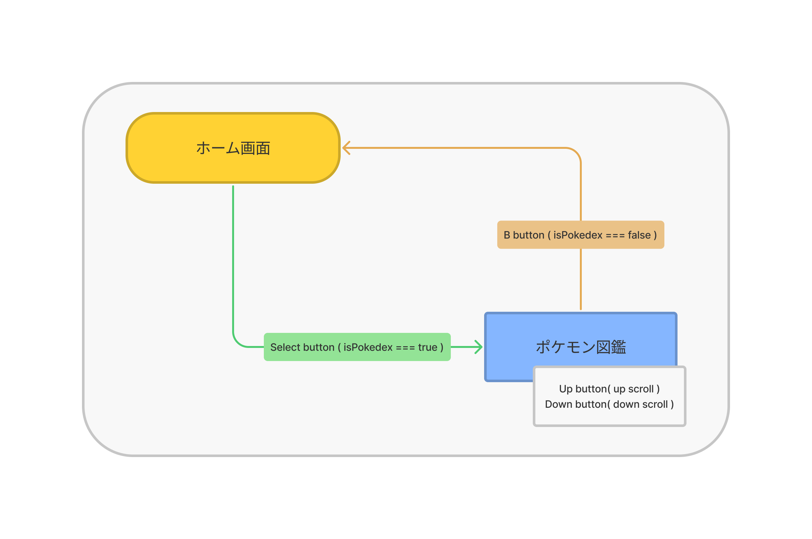

### localStorage に保存したデータを取得して表示

```tsx
// Pokedex.tsx

export const Pokedex = () => {
const storageData = localStorage.getItem("storageData");
const parsedStorageData: PokemonData = storageData ? JSON.parse(storageData) : [];

...

<div>
	{parsedStorageData?.length === 0 ? (
	  <div></div>
  ) : (
    parsedStorageData?.map((data, index) => (
		...
```

### 十字キーでのポケモン図鑑スクロール

ポケモン図鑑の十字キーでのスクロール機能は少し苦戦しました。

1. ポケモン図鑑のデータ数によって要素の高さをセット

   ```tsx
   // CrossKey.tsx
   ...

   const [displayHeight, setDisplayHeight] = useState(0);
   const storageDataLength = useRecoilValue(storageDataLengthState);

   useEffect(() => {
   // 見出しの高さ + 配列の数 _ 要素一つあたりの高さ - 画面の高さ
   const calcDisplayHeight = 16 + storageDataLength _ 216 - 240;
   setDisplayHeight(calcDisplayHeight < 0 ? 0 : calcDisplayHeight);
   }, [storageDataLength]);

   ...
   ```

2. スクロールアップ、スクロールダウンの機能

   ```tsx
   // CrossKey.tsx
   ...

   const isPokedex = useRecoilValue(isPokedexState);
   const [scrollY, setScrollY] = useRecoilState(scrollYState);

   const scrollUp = useCallback(() => {
   // マイナスの数値になったら 0 をセット
   if (scrollY - 40 <= 0 || !isPokedex) {
   setScrollY(0);
   return;
   }
   setScrollY(scrollY - 40);
   }, [isPokedex, scrollY, setScrollY]);

   const scrollDown = useCallback(() => {
   // 要素の高さ以上にならないようにする
   if (scrollY + 40 >= displayHeight) {
   setScrollY(displayHeight);
   return;
   }
   setScrollY(scrollY + 40);
   }, [displayHeight, scrollY, setScrollY]);

   ...
   ```

   再度ポケモン図鑑を開いたときに中途半端な位置にスクロールがセットされていないように、ポケモン図鑑画面以外の画面では scrollY に 0 をセットするようにします。

   また、 scrollY の値がマイナスになったり要素の高さ以上にならないように制御します。（制御できてないと十字キーを押しても動作しないような挙動になってしまう）

3. ポケモン図鑑画面で scrollY を受け取ってスクロールする

```tsx
// Pokedex.tsx
...

const ref: LegacyRef<HTMLDivElement> | undefined = useRef(null);

const scrollY = useRecoilValue(scrollYState);

useEffect(() => {
    ref.current?.scrollTo({ top: scrollY, behavior: "smooth" });
  }, [scrollY]);

  return (
    <div ref={ref} className="overflow-auto w-auto h-60">
...
```

## 図鑑データ削除機能

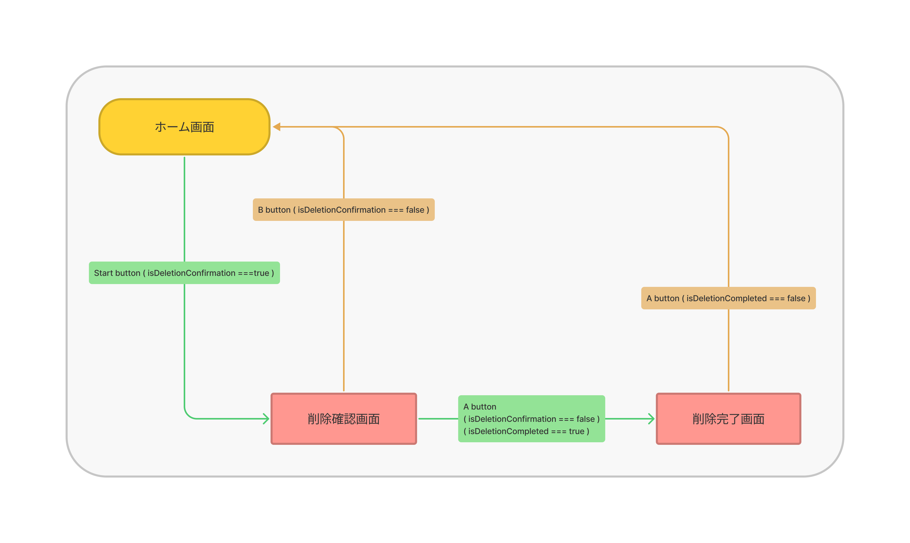

localStorage に保存したデータは永久に消えないということで削除機能もしっかり実装しました。

```tsx
const handlePressA = useCallback(() => {
	// Start ボタンを押した後の削除するかの確認画面の場合の動作
    if (isDeletionConfirmation) {
      // localStorage のデータ削除
      localStorage.clear();
      setIsDeletionConfirmation(false);
      setIsDeletionCompleted(true);
      return;
    }

    if (isDeletionCompleted) {
      // トップ画面へ遷移
      setIsDeletionCompleted(false);
      return;
    }
		...
```

## ボタンクリック時の意図しない動作を防ぐ

アニメーション中にボタンクリックで別画面にいってしまったり、削除確認画面からガチャ実行画面に遷移したりするのを防ぐために button に disabled の設定を書いて制御します。

```tsx
<button
  type="button"
  // アニメーション中またはポケモン図鑑画面ではボタンを無効化する
  disabled={isAnimation || isPokedex}
  onClick={handlePressA}
  className="flex justify-center items-center w-16 h-16 text-2xl text-gray-700 bg-gray-800 rounded-full shadow-sm active:shadow-none shadow-black"
>
  A
</button>
```

# おまけ

十字キーの左右ボタンに特に機能が割り当てられていなかったのでカラーチェンジ機能をつけました。

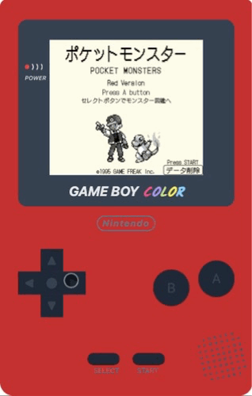

```tsx
// CrossKey.tsx

const colorNumUp = useCallback(() => {
  // number が3の場合は0にセット
  if (gameBoyColorNum === 3) {
    setGameBoyColorNum(0);
    return;
  }
  setGameBoyColorNum(gameBoyColorNum + 1);
}, [gameBoyColorNum, setGameBoyColorNum]);

const colorNumDown = useCallback(() => {
  // number が0の場合は3にセット
  if (gameBoyColorNum === 0) {
    setGameBoyColorNum(3);
    return;
  }
  setGameBoyColorNum(gameBoyColorNum - 1);
}, [gameBoyColorNum, setGameBoyColorNum]);
```

```tsx
<div
	className={`relative pt-1 pb-2 mx-auto max-w-md min-h-[704px] rounded-xl rounded-b-3xl shadow ${
	  gameBoyColorNum === 0
	    ? "bg-[#C83031]"
      : gameBoyColorNum === 1
      ? "bg-[#FED20D]"
      : gameBoyColorNum === 2
      ? "bg-[#543DB8]"
      : "bg-[#1C9ACD]"
  }`}
>
```

# まとめ

最後まで読んでいただきありがとうございました！

一回作ってみてうまくできなかったものを、いろいろな勉強をした後に再度作ってみるというのはとても勉強になりました！

まだ命名の仕方や設計など課題はたくさんありますが、ひとつひとつ学習していきます！！

もし、バグがあったりもっとこうした方が良いんじゃないのかとかありましたら教えていただけると嬉しいです！
